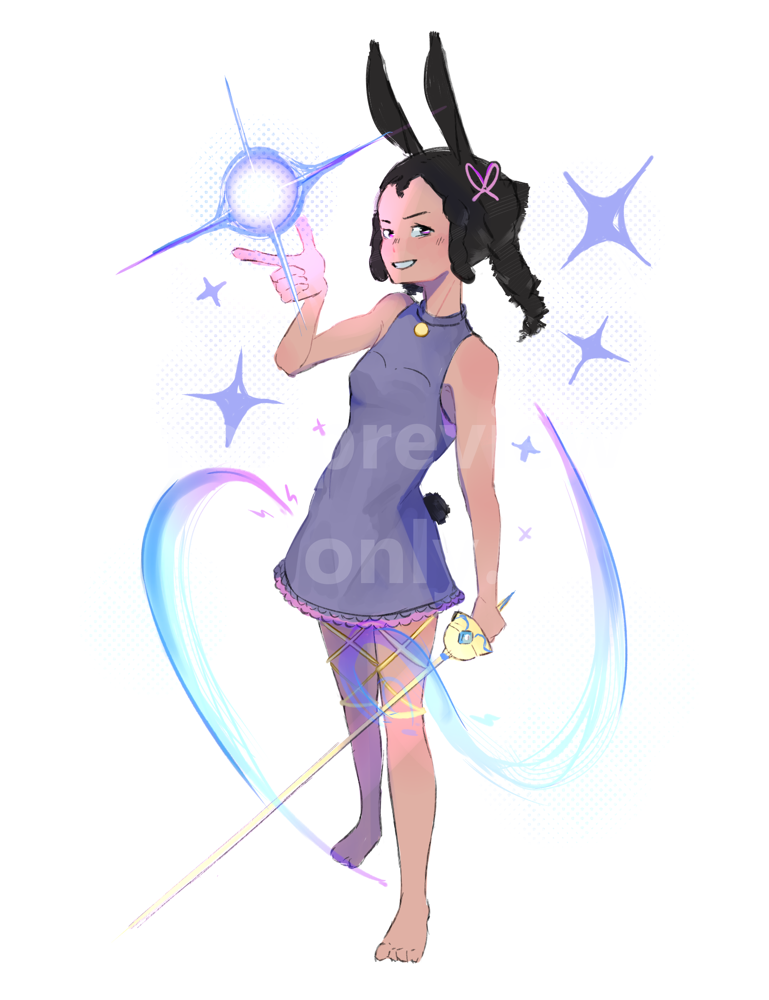

<!--# Hi I'm Jeremy Ortega 👋 -->

 
  ## <i>" If you can imagine it, It can be drawn "</i>
 

 I’m currently pursuing a Bachelor’s degree in Information Systems. In my free time, I enjoy creating digital art and editing videos. I’m always eager to learn new skills and connect with new people.

 🎯 Goal 
 ---
To be on a job field where I can translate my passion for art / designing into reality. Whether it may be in Ui/Ux , Concept Artist, Game Designer.

---
<table align="center">
<tr>
 <tr> 
  <td align="center">
   
 🛠️ Tech tools

  </td>
  <td align="center">
   
 📖 Currently studying

  </td>

 </tr>
 

<td align="center" width="50%">
  
 

 
 

</td>
<td align="center" width="50%">

 

</td>
</tr>
</table>

    
  
 <samp> 🎨 Some Art illustrations
</samp>

 
<table align="center">
<tr>
 
 <tr> 

 </tr>
 
<td align="center" width="50%">

</td>

</tr>
</table>

</samp>

 ## 🌐 Socials:
 
 
 
 

## 📊 GitHub Stats:
<!-- -->
 

## 🔝 Top Contributed Repo

---

  

